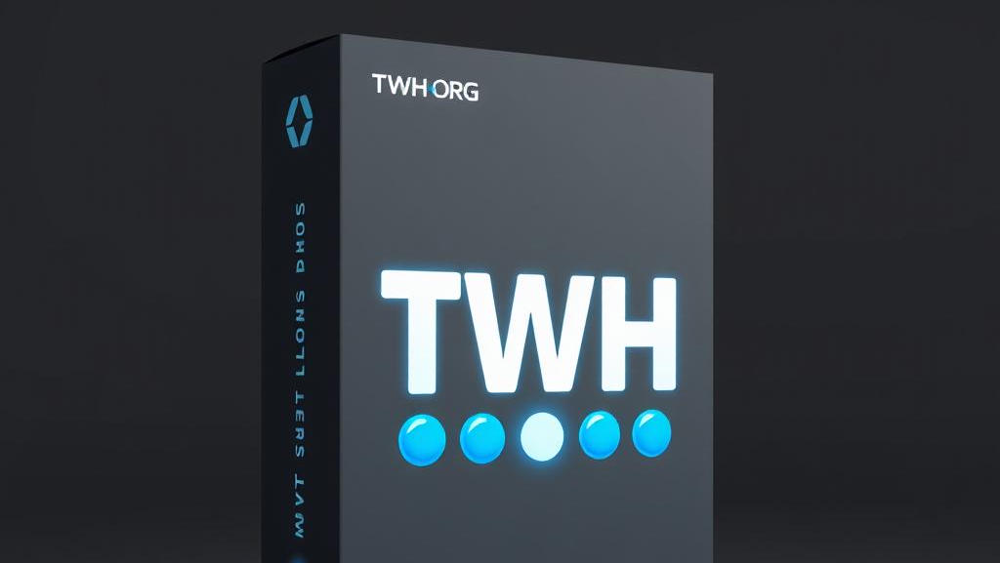

  

<h1 align="center">👋 Welcome to HackingVlog on GitHub!</h1>

  This is the official GitHub space for <strong>HackingVlog</strong> — your go-to source for cybersecurity tips, ethical hacking tutorials, and tech deep-dives.

---
# 💫 About Me:
To pursue a challenging career by using my knowledge and experience to trigger symbiotic growth and promote learning. motivation, and teamwork to contribute to the growth and profitability of the organization.
---

## 🔐 Who We Are

We're passionate about **ethical hacking**, **cybersecurity education**, and sharing real-world knowledge that empowers learners to think like a hacker — but act like a protector. 🛡️

---
# 📊 GitHub Stats:
 
 

## 🏆 GitHub Trophies

---
## 📁 What You'll Find Here

- 🧠 Ethical Hacking Scripts & Tools  
- 💻 Bug Bounty Practice Labs  
- 🔒 Cybersecurity Projects & Resources  
- 📚 Code from HackingVlog YouTube Tutorials  

---
# 💻 Tech Stack:
                     
---

## 🛠️ Technologies & Tools I Use

### 💻 Operating Systems
- 🐉 Kali Linux — main hacking OS  
- 🦜 Parrot OS — alternative pentesting distro  
- 🪟 Windows — for client-side exploits & testing  
- 🐧 Ubuntu — general Linux use  
- 📱 Android (via Termux) — mobile hacking  

### ⚔️ Hacking & Security Tools
- Nmap — network scanning  
- Metasploit Framework — exploitation framework  
- Burp Suite — web app testing  
- Wireshark — packet analysis  
- John the Ripper / Hashcat — password cracking  
- SQLmap — database exploitation  
- Aircrack-ng — WiFi hacking  
- Hydra — brute force attacks  
- Nikto / Dirb / Gobuster — web enumeration  

### 🌐 Networking Tools
- Postman — API testing  
- Netcat — reverse shells and connections  
- TCPDump — packet capture  

### 🔐 CTF & Practice Platforms
- TryHackMe 🧠  
- Hack The Box 🧪  
- OverTheWire  
- VulnHub  
- PortSwigger Academy  

### 🧰 Other Tools
- Git & GitHub — version control  
- VS Code — lightweight coding editor  
- Tmux — terminal multiplexing  
- VirtualBox / VMware — virtualization for labs  

---

## 🖥️ Languages I Code In

- 🐍 Python — scripting, automation, exploits  
- 🐚 Bash — shell scripting & Linux automation  
- 🛠️ JavaScript — web hacking & payloads  
- 🐘 PHP — basic web vuln practice  
- 🌐 HTML / CSS — understanding web structure  

---
### ✍️ Random Dev Quote

### 🔝 Top Contributed Repo

---

## 🔗 Connect with Me

- 📸 [Instagram](https://www.instagram.com/nasirz11/)
- 💼 [LinkedIn](https://www.linkedin.com/in/nasir-ali-322112275)
- 📘 [Facebook](https://www.facebook.com/arfa.ansari.106)

---
## 🌐 Socials:
     
---
## 🎮 Fun Facts

- 🎮 I love video games  
- 📚 Always exploring new tech & reading books  
- 👨‍💻 Passionate about hacking & cybersecurity  
- 🧠 Self-learner and CTF enthusiast  

---

> Thanks for visiting! Stay curious, stay secure. 🛡️  
> — **HackingVlog Team**
